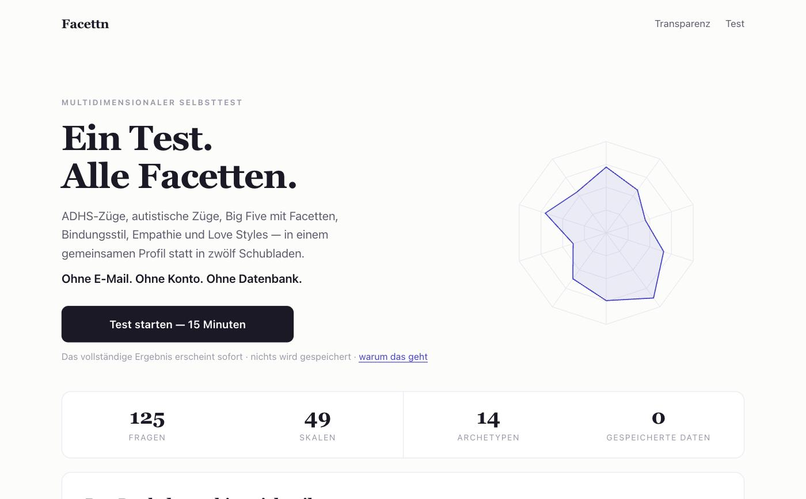
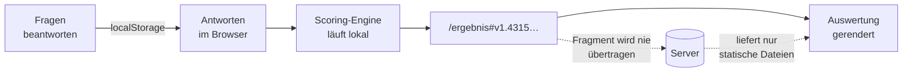
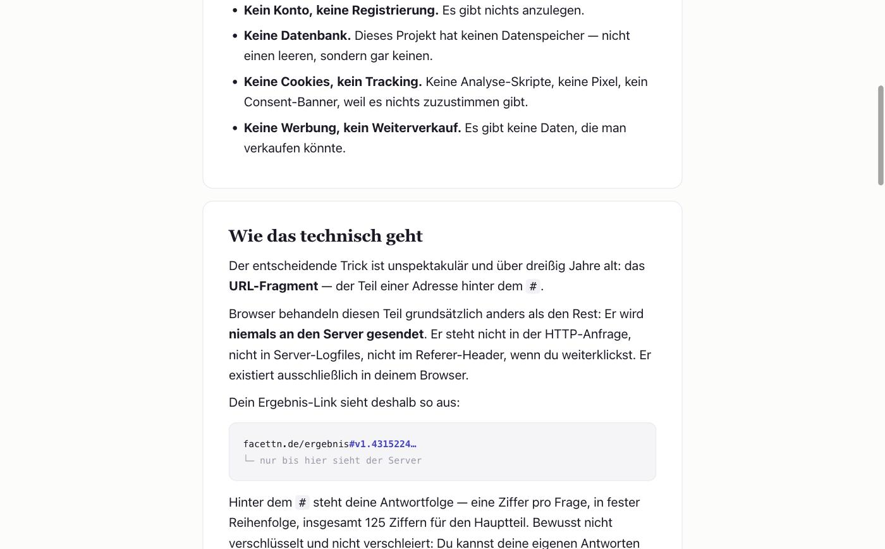

<p align="center">
  
</p>

<p align="center">
  <a href="https://github.com/Lang-Julian/facettn/actions/workflows/ci.yml"></a>
  
  
  
  
  
</p>

<h1 align="center">Der Persönlichkeitstest, der nichts von dir speichert</h1>

<p align="center">
  Kein Konto. Keine E-Mail-Abfrage. Keine Datenbank. Keine Cookies, kein Tracking.<br>
  Deine Antworten werden <b>in deinem Browser</b> ausgewertet — dein Ergebnis steckt im<br>
  URL-Fragment, dem Teil hinter dem <code>#</code>, den Browser prinzipbedingt nie an einen Server senden.
</p>

---

## Warum das existiert

Die meisten Persönlichkeitstests im Netz folgen demselben Drehbuch: vierzig Fragen
beantworten, einen Teaser sehen, an die Wand stoßen. *E-Mail eintragen, um dein
vollständiges Ergebnis freizuschalten.* Der Test war nie das Produkt. Du warst es.

Facettn ist die Gegenprobe. Die vollständige Auswertung erscheint sofort und in voller
Tiefe. Es gibt kein E-Mail-Feld, weil es keine Liste gibt. Es gibt keine Löschfunktion,
weil es keine Datenbank gibt. Und weil Datenschutzversprechen nichts wert sind, wenn
sie niemand nachprüfen kann, liegt alles offen: die Fragen, das Gewicht jeder einzelnen
Antwort, die Formeln, die Texte.

<table>
  <tr>
    <td width="50%"></td>
    <td width="50%"></td>
  </tr>
  <tr>
    <td align="center"><sub>Startseite</sub></td>
    <td align="center"><sub>Auswertung — nummerierte Abschnitte, PDF-Export</sub></td>
  </tr>
</table>

## Wie „nichts gespeichert" technisch funktioniert

Der entscheidende Mechanismus ist unspektakulär und über dreißig Jahre alt: das
**URL-Fragment**.

```
facettn.de/ergebnis#v1.4315224…
                    └─ verlässt den Browser nie
```

Browser behandeln alles hinter dem `#` grundsätzlich anders als den Rest einer
Adresse. Es steht nicht in der HTTP-Anfrage, nicht im `Referer`-Header, in keinem
Server-Logfile. Es existiert ausschließlich auf den Geräten, die den Link haben.

Der Payload ist bewusst langweilig: eine Ziffer pro Antwort, in fester Reihenfolge,
mit Versions-Präfix. Nicht verschlüsselt, nicht verschleiert — du kannst deinen
eigenen Link von Hand dekodieren. Ein System, dessen Datenhaltung man durch Lesen
einer URL überprüfen kann, muss man nicht glauben.



Zwei Konsequenzen, die man kennen sollte:

- **Der Link ist das Ergebnis.** Als Lesezeichen speichern, um zurückzukommen. Geht er
  verloren, ist das Ergebnis weg — auch für uns, weil es nie woanders existiert hat.
- **Teilen heißt wirklich teilen.** Wer den Link hat, sieht das Profil. Das optionale
  Wohlbefindens-Modul wird aus Teilen-Links automatisch entfernt; dort steht die Frage
  nach Suizidgedanken, und die hat in einem weitergegebenen Link nichts zu suchen.

<p align="center">
  
</p>

## Das Instrument

| | |
|---|---|
| **Fragen** | 119 inhaltliche + 3 Aufmerksamkeitskontrollen + 3 Soziale-Erwünschtheit + 16 optionale Wohlbefindens-Fragen |
| **Dauer** | ~15 Minuten |
| **Skalen** | 5 Big-Five-Domänen mit je 3 Facetten · ADHS (2 Facetten) · autistische Züge (6 Facetten) · Masking · 4 Dark-Trait-Skalen · kognitive/affektive Empathie · 3 Bindungsskalen · 6 Love Styles · 3 Sensibilitätsskalen |
| **Ausgabe** | Archetyp · 10-Achsen-Radar · Facetten-Balken · erkannte Wechselwirkungen · Mythen vs. Fakten · Alltagstipps · Quellenverzeichnis mit DOIs · PDF-Export |

Fragen laden bewusst auf **mehrere Skalen gleichzeitig**. Das ist keine Abkürzung zu
weniger Fragen, sondern bildet ab, dass Merkmale sich real überlappen: Wer impulsiv
handelt, kann das aus ADHS-typischer Impulskontrolle tun oder aus bewusster
Geringschätzung von Regeln. Die umgebenden Fragen entscheiden, welche Lesart trägt.

Der Test ist mit Absicht lang. Mit zwanzig Fragen lässt sich nicht unterscheiden, ob
jemand unordentlich **und** unzuverlässig ist oder unordentlich **aber** grundsolide —
und genau das ist der interessante Teil. Daher Facetten unter jeder Domäne.

### Was dieser Test nicht ist

Kein Diagnose- oder Screening-Instrument. Er beschreibt Ausprägungen von
Persönlichkeit — „Züge", keine Krankheiten. Nichts hier erkennt, screent oder
diagnostiziert etwas, und die Sprache ist bewusst so gehalten (siehe die Notiz in
`src/lib/content/copy.ts`). Für echte Klarheit bei echtem Leidensdruck braucht es
Menschen, keine Website.

## Lizenzstatus der Fragen

Jede inhaltliche Frage ist eine **eigenständige deutsche Formulierung**, für dieses
Projekt geschrieben. Sie orientieren sich an publizierten *Konstrukten* — der
Big-Five-Facettenstruktur (IPIP/BFI-2), den DSM-5-Domänen für Aufmerksamkeit und
Hyperaktivität, der Camouflaging-Forschung, dem triarchischen Psychopathie-Modell, den
ECR-Bindungsdimensionen, der Sensory-Processing-Sensitivity — übernehmen aber keinen
Wortlaut aus geschützten Skalen. Das hält das Repository MIT-sauber.

Die einzigen wörtlich verwendeten Instrumente sind **PHQ-9 und GAD-7** (deutsche
Fassung; Löwe, Spitzer, Zipfel & Herzog, Übersetzung Universitätsklinik Heidelberg),
die der Rechteinhaber ausdrücklich zur freien Vervielfältigung freigegeben hat.

Dieses Projekt ist nicht mit den Autorinnen und Autoren der referenzierten
Original-Instrumente assoziiert. Das vollständige Quellenverzeichnis mit DOIs liegt in
[`src/lib/content/references.ts`](src/lib/content/references.ts) und wird in jeder
Auswertung mit ausgegeben.

## Architektur

```
src/lib/engine/      Reines Scoring: Reverse-Kodierung, Cross-Loading-Normierung,
                     Φ-Perzentile, Bänder, Validitäts-Flags, Archetyp-Auflösung,
                     Match-Formel. Kein I/O, vollständig unit-getestet.
src/lib/seed/        Items + Loading-Matrix (zusammen), Skalen mit Facetten,
                     Archetypen, publizierte Normwerte.
src/lib/share/       Der URL-Payload-Codec.
src/lib/content/     Dimensionstexte, Muster-Regeln, Quellen, Rechtstexte.
src/lib/profile.ts   Antworten → vollständiges Profil. Läuft im Browser.
src/app/             Startseite, /test, /ergebnis, /vergleich, /transparenz,
                     /archetyp/[slug] (statisch), Rechtsseiten.
```

Es gibt kein `api/`-Verzeichnis, keinen Datenbank-Client und kein ORM. Diese Abwesenheit
ist das Feature. Laufzeit-Abhängigkeiten: `next`, `react`, `react-dom`.

## Rechtsseiten sind ein Gate, kein TODO

Ein öffentlich erreichbares deutschsprachiges Angebot braucht ein vollständiges
Impressum (§ 5 DDG); ein fehlendes ist ein reales Risiko für die betreibende Person.
Die Betreiberangaben liegen deshalb als getippte Konfiguration in
[`src/lib/content/legal.ts`](src/lib/content/legal.ts), und
[`scripts/check-legal.ts`](scripts/check-legal.ts) **bricht das Deployment ab**,
solange ein Pflichtfeld leer ist:

```bash
npm run check:legal    # beendet sich mit Fehler, solange unvollständig
npm run build:public   # Prüfung + Build, wird vom Pages-Workflow genutzt
```

Lokal baut und läuft die Seite weiterhin mit Platzhalter-Rechtsseiten, die Entwicklung
ist also nicht behindert. Blockiert wird nur der Weg, der sie öffentlich erreichbar
macht — genau dort entsteht die Pflicht. Diese eine Datei auszufüllen ist der einzige
Schritt zwischen lokalem und öffentlichem Build.

## Entwicklung

```bash
npm ci
npm run dev        # http://localhost:3000
npm test           # 53 Unit-Tests
npm run typecheck && npm run lint && npm run build
```

Alle Seiten sind statisch vorgerendert — kein serverseitiger Zustand, keine
Umgebungsvariablen zum Betrieb oder Deployment. Hostbar überall, wo Dateien
ausgeliefert werden. Die CI läuft `typecheck → lint → test → build` ohne ein einziges
Secret; genau das ist der Beweis, dass hier nichts zu konfigurieren ist.

## Mitmachen

Eine schlecht formulierte Frage, ein Gewicht, das der Prüfung nicht standhält, ein
Denkfehler in der Auswertung — das ist ein willkommener Beitrag, kein Ärgernis. Siehe
[CONTRIBUTING.md](CONTRIBUTING.md) für die nicht verhandelbaren Grundregeln.

## Status und offene Punkte

Ehrlichkeit über den Reifegrad gehört zur Vertrauenswürdigkeit:

- Die selbst formulierten Fragen sind **psychometrisch noch nicht validiert**. Vor
  Aussagen über Reliabilität oder Faktorstruktur braucht es eine Pilotstudie (N ≥ 300).
- Perzentile existieren nur für die Big-Five-Domänen (deutsche BFI-2-Referenzstichprobe,
  Danner et al. 2019, N = 770). Andere Skalen weisen Rohwerte ohne
  Bevölkerungsvergleich aus, statt einen zu erfinden.
- Die Cross-Loading-Gewichte sind theoriegeleitete Startwerte und warten auf
  empirische Kalibrierung.
- Impressum und Datenschutzerklärung enthalten `[TODO]`-Platzhalter. Vor einer
  öffentlichen Veröffentlichung ist ein vollständiges Impressum nach § 5 DDG Pflicht.

## Lizenz

MIT — siehe [LICENSE](LICENSE).
